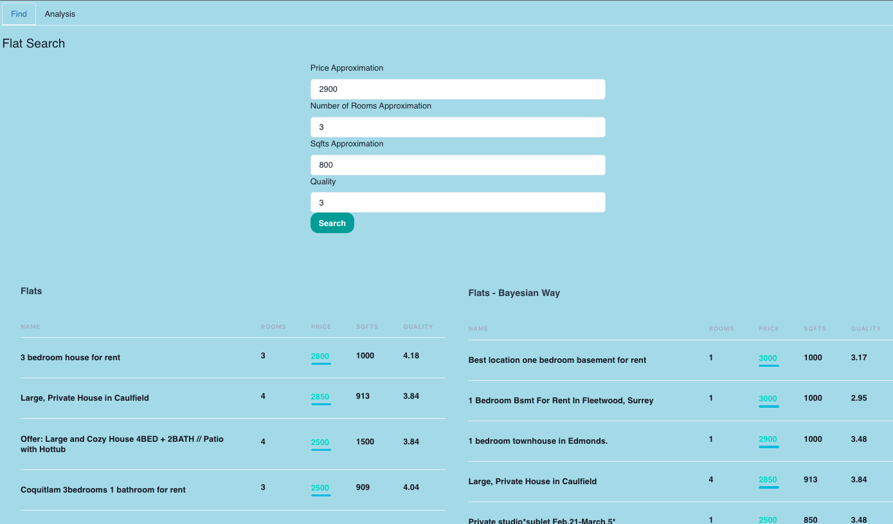
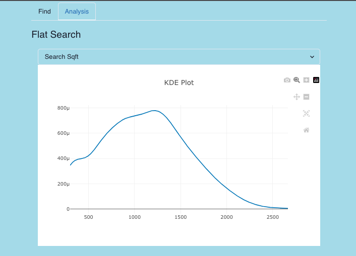

# ByFinder
ByFinder is a state-of-the-art, probabilistic-based system for apartment recommendations that employs Bayesian networks to provide personalized and reliable recommendations to users. The problem it addresses is the current lack of reliability and personalization in existing apartment recommendation systems, particularly in their inability to incorporate uncertainty in data and the lack of consideration of individual user preferences.

## Real-life Cases
The beauty of ByFinder is that it can be used in everyday scenarios. Consider a person who is new to the city and is searching for an apartment. With traditional methods, the individual would have to spend numerous hours trawling through websites to find their perfect apartment. With ByFinder, this person will just input their preferences once and ByFinder will provide a list of apartments that best match these preferences, even considering the uncertain elements.

Another scenario could be a family planning to move to a larger apartment within the city. They would like to stay close to their children's school and prefer a spacious apartment with a reasonable rent. ByFinder will consider all these preferences, balancing them to provide a list of optimal choices.

## Tech Stack
ByFinder is built on an advanced stack that combines both frontend and backend technologies:

Python, JavaScript (JS), Chakra UI, FastAPI, Celery, MongoDB, Docker
## Approach
At the heart of ByFinder is the use of Bayesian networks, which can account for imprecise probabilities. The system uses data on user preferences along with industry standards to create a model that predicts the most optimal flats for the user.

The use of bayesian networks allows ByFinder to model the uncertainties inherent in the house-finding process. By capturing these uncertainties, ByFinder can provide more reliable and personalized recommendations. The model is updated periodically to take into account the latest user preferences and industry trends.

User preferences are stored in a MongoDB database and used to personalize the recommendations. The system takes into account factors such as price, number of rooms, quality, square footage, and distance to predict the most optimal flats for the user.

## Unique value of this Approach
Personalized Recommendations: By taking into account user preferences, ByFinder can provide personalized recommendations that are more likely to satisfy the user's requirements.

Reliable Predictions: The use of bayesian networks allows ByFinder to model uncertainties, which leads to more reliable predictions.

Scalable: With technologies such as Docker and Celery, ByFinder can scale to handle a large number of users and a large amount of data.

Adaptable: The model is updated periodically, making the system adaptable to changing user preferences and industry trends.

ByFinder represents a significant leap in the field of apartment recommendations, providing personalized, reliable, and up-to-date recommendations to users.
